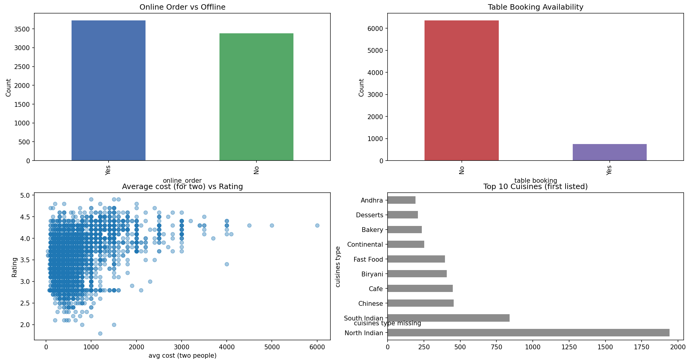

#Food Delivery Trends (Zomato Data EDA)
Exploratory Data Analysis of Zomato dataset to find patterns in:
- Online orders
- Table booking
- Cuisine types
- Average cost for two
- Ratings distribution
## Steps
- Cleaned and preprocessed data
- Visualized trends with histograms, scatter plots, and bar charts 
- Extracted key business insights
## Example Output

## Tools Used
- Python (pandas, matplotlib, seaborn)
- VS Code
- GitHub for version control
